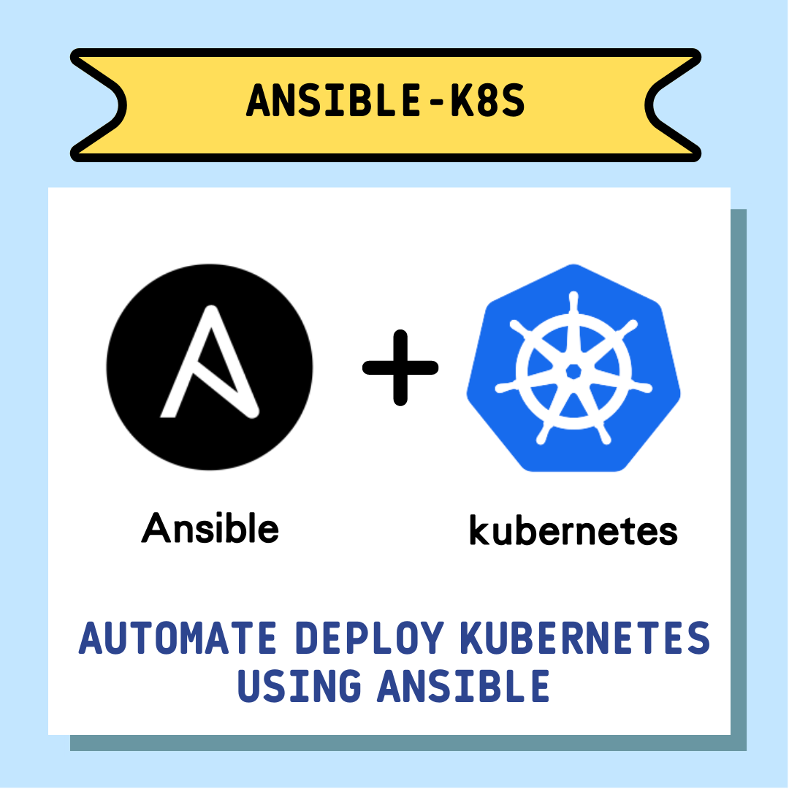
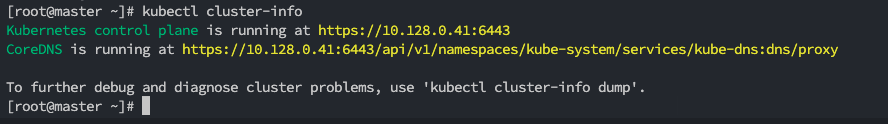
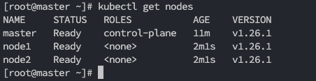

# ansible-k8s

## Intro👨‍💻
在gcp環境下使用ansible playbook 建立k8s cluster，目前base image為centos 7，安裝方式類似elk stack，一樣先等master安裝完後產生token，接著安裝slave。
使用的CRI為containerd，CNI為calico
## 資料夾結構
```shell
.
├── README.md
├── create_k8s_master_instance.yaml
├── create_k8s_slave_instance.yaml
├── files
│   ├── instance
│   └── k8s
├── group_vars
│   └── all
├── inventory
│   └── k8s.cluster.host
├── inventory.instance.create.yml.example
├── k8s-setup.sh
├── roles
│   ├── instance
│   ├── k8s
│   ├── monitor
│   └── ops_agent
└── vars
    ├── instance
    ├── k8s
    └── monitor
```

## 使用指南
1. 設定機器資訊：複製好inventory.instance.create.yml.example後，可參考inventory裡的設定，主要設定gcp的資訊，

2. 設定group_vars的env.yml，改成自己的gcp的專案以及要設定的region

3. 可使用k8s-setup.sh進行一鍵安裝
```
sh ./k8s-setup.sh
```
## 建置流程
k8s_master -> k8s_slave

- 指令
```shell
ANSIBLE_HOST_KEY_CHECKING=False ansible-playbook -i inventory.instance.create.yml create_xxx_instance.yaml -v
```

安裝完後可以去master切成root確認是否有組成cluster



## 預計添加功能

- [ ] 添加自定義CRI與CNI
- [ ] 可選k8s版本
- [ ] 可依照base image進行相對應的安裝


## Reference
- [Install Kubernetes Cluster on CentOS 7 with kubeadm | ComputingForGeeks](https://computingforgeeks.com/install-kubernetes-cluster-on-centos-with-kubeadm/)
- [Automating Kubernetes Cluster Using Ansible | by Shubham Mehta | Medium](https://shubham134.medium.com/automating-kubernetes-cluster-using-ansible-2bce48a82a10)
